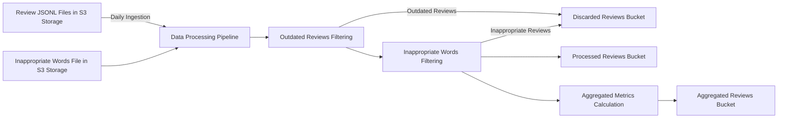
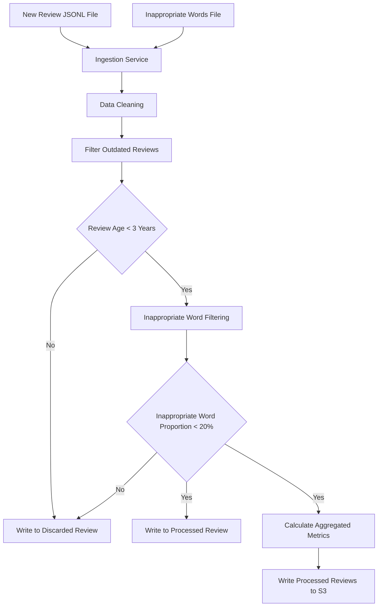

# ReviewIngestionSystem

# Design Document : Review Ingestion System
## 1. Project Overview
The Restaurant Review Ingestion System is designed to ingest, process, and store restaurant reviews. The system will filter out inappropriate words, discard outdated and inappropriate reviews, and compute aggregated metrics for analysis. The processed reviews, aggregations and discarded reviews will be stored in a data lakehouse for further analysis.

## 2. Architecture Design 

## 3. Data Flow Diagram
### Review Ingestion Pipeline

## 4. Components Description
* **Review JSONL Files in S3 Storage:** Stores the incoming `reviews.jsonl` files and the `inappropriate_words.txt` file.
* **Data Processing Pipeline:** The ETL pipeline sources the input data and builds the dataframe for processing reviews, filtering, and computations.
* **Outdated Reviews Filtering:** Filters out the outdated reviews by implementing a date based check, as they might no longer reflect the reality of the restaurant today. A review is considered outdated if it is more than 3 years old from the date of processing.
* **Inappropriate Words Filtering:** Filters out the inappropriate reviews by implementing a threshold based check. The threshold for "inappropriate words per review" until it is considered inappropriate as a whole is 20% of words of the entire text.
* **Aggregated Metrics Calculation:** Aggregated the processed reviews to produce the aggregated metrics.
* **Discarded Reviews Bucket:** Stores reviews that are discarded due to being outdated or having too many inappropriate words.
* **Processed Reviews Bucket:** Stores reviews after all processing steps.
* **Aggregated Reviews Bucket:** Stores computed aggregated metrics for further analysis.

## 5. Deployment Strategy
**1. Cloud Provider: AWS**
   *  BLOB Storage: Use AWS S3 to store the input `reviews.jsonl` and `inappropriate_words.txt`.
   *  Data Processing: AWS Glue to run the jobs.
   *  Data Warehouse: Data Lake can be used to push the final review file.
   *  Scheduler: Implement AWS Lambda with CloudWatch Event to trigger the daily runs.

**2. Environment Setup:**
   * Set up the S3 buckets for the incoming input reviews and inappropriate words file.
   * Set up the S3 buckets for output reviews: Aggregated Reviews Bucket, Processed Reviews Bucket, and Discarded Reviews Bucket.
   * Configure IAM Roles and other policies to ensure security.

**3. Scaling Strategy:**
   *  Use AWS Glue which scales automatically based on the workload.
   *  Utilize Spark for distributed data processing, ensuring efficient handling of large datasets and parallel processing of reviews.
   *  Setup CloudWatch for monitoring the systems performance.

**4. Performance Strategy**
   *  Leverage Spark Framework to efficiently handle and build the Review Ingestion Pipeline.
   *  Use spark optimization techniques like cache the data frame in memory to avoid reading it into memory each time.
   *  Use repartition along with groupBy to avoid unnecessary shuffles.

## 6. Steps followed in the Review Ingestion Pipeline
**1. Ingestion Service:**
* Trigger daily to process the new `reviews.jsonl` files from the S3 storage bucket.
* Load the inappropriate word list file `inapproporiate_words.txt` from S3 bucket to create a list of inappropriate words.
* Create a spark dataframe from `reviews.jsonl`. 

**2. Data Cleaning**
*  Clean the reviews Dataframe by removing the records which contain null values, adhering to the schema of `reviews.json` 

**3. Filter Outdated Reviews:**
* Find out the age of each review in days by considering today's date and the publishedAt date.
* Discard reviews older than 3 years.
  
**4. Filter Inappropriate Words:**
* Replace inappropriate words in each review with asterisks (`****`).
* Calculate the proportion of inappropriate words in each review.
* Discard reviews where the proportion of inappropriate words exceeds 20%.

**5. Aggregation Metrics:**
* Calculate Aggregated Metrics for each of the restaurantIds.
* Number of reviews, average score, average length of review, and review age (oldest, newest, average).

**6. Writing to the S3 Buckets:**
* Write Processed Reviews: Write the cleaned and filtered reviews to the `processed reviews` S3 bucket.
* Write Aggregated Metrics: Write the aggregated metrics to the `aggregated reviews` S3 bucket.
* Write Discarded Reviews: Write the discarded reviews to the `discarded reviews` S3 bucket. This will contain the outdated and inappropriate reviews.

## 7. Conclusion
This design ensures that the review ingestion system is scalable, robust, and can handle the requirements and constraints provided. By leveraging AWS services, we can achieve a cost-effective and efficient solution that processes, filters, and aggregates reviews while ensuring that outdated and inappropriate content is handled appropriately. This design is open to more modifications and optimizations.
